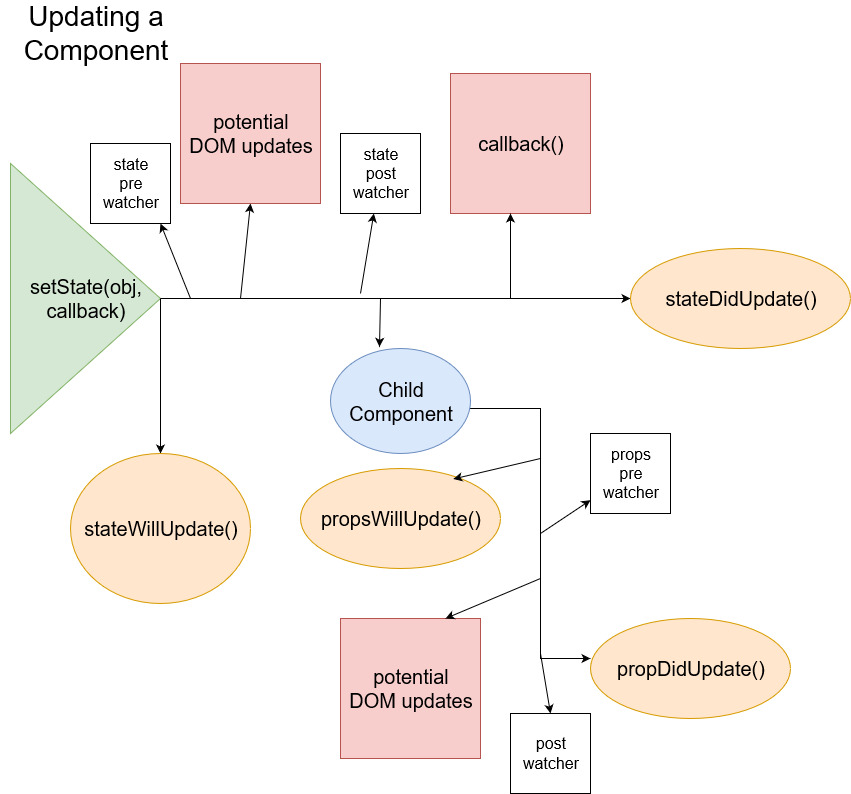

# DOMponent
__Make components with the HTML you already have__


## How To:
1. Drop a few `data` attributes into your existing HTML
```html

<div data-component="Counter">
  <p data-bind="state:count">0</p>
  <button data-action="click:increment">
  +1
  </button>
  <button data-action="click:decrement">
  -1
  </button>
<div>


```
2. Write a JavaScript `class` component
```js
import { Component } from 'domponent';

export default class Counter extends Component{
  constructor(el){
    super(el);
  }
  
  increment(){
   this.setState({count: (this.state.count + 1)});  
  }
  
  decrement(){
   this.setState({count: (this.state.count - 1)});  
  }
}

```
3. Initialize the App
```js
import Init from 'domponent';
import Counter from './Counter.js';

const config = {
  selector: document.getElementById('root),
  components: {
    Counter
  }
};

new Init(config);

```
__And you're good to go!!__

## `data` API

### `data-component`
We use this bad boy to match the component name to its corresponding `class` in the `Init` configuration object

example: if your HTML is `data-component="Counter"` | you must have a component in your config called `Counter`

### `data-bind`
Binds `state` or `props` to the `textContent` of an element
First you specify if you want to bind `state` or  `props` `data-bind="state:count"` or `data-bind="props:count"`
The left half of the `:` tells the component what object to bind to (state or props), the right half tells the component what key within the state or props to read from

### `data-action`
Binds a DOM event with a component method.
Consider the following:
```html
<button data-action="click:increment">
+1
</button>
```
The left half of the `:` represents the literal string for the DOM event to listen for.  The right half corresponds to the component method

Note: You can add multiple listeners with a pipe `|`
example:
```html
<button data-action="click:increment|mouseover:anotherMethod">
+1
</button>
 ```
### `data-state`
If you want to instantiate your component with a particular state __in memory__ you must attach a `data-state` attribute to the __root element__ of the component
example:
```
<div data-component="Counter" data-state="count:24">
  ...
</div>
```

For multiple keys within the state, use a pipe `|` like so: `count:24|isEven:true`

### `data-props`

### `data-key`

## Extending the `Component` class
Let's continue with Counter.  The minimum js needed to create a component is below:
```js
class Counter extends Component{
  constructor(el){
    super(el)
  }
}
```
`super` adds the base methods and properties your component needs.

## Managing Component State
### `setState`

## LifeCycle Methods
### `componentMade`
### `stateWillUpdate`
### `stateDidUpdate`
### `propsWillUpdate`
### `propsDidUpdate`

## Dynamically adding and removing components

### Adding components
#### `createComponent`
#### `register`

### Deleting components
#### `deleteComponent`
#### `unregister`

## An overview of application lifecycle


--------

